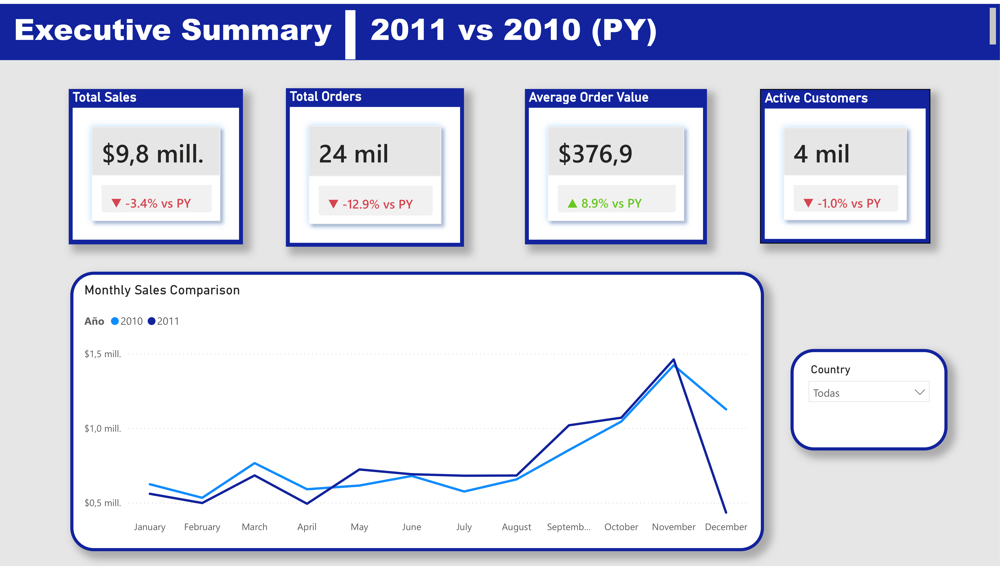

# Power BI Retail Analytics Dashboard

## Overview
This project is an interactive business intelligence dashboard developed with Microsoft Power BI to analyse sales, customers, products and geographical performance in an online retail business.

The main objective of the project was to learn how to transform raw transactional data into meaningful business insights and develop a dashboard that could support data-driven decision-making.

The project uses the Online Retail II dataset, containing transactional data from an online retail business for 2010 and 2011. 
https://archive.ics.uci.edu/dataset/502/online+retail+ii

## Project Objectives
The dashboard was designed to answer key business questions such as:

- How are sales performing compared with the previous year?
- How many orders and active customers does the business have?
- Which customers generate the most revenue?
- Which customer segments are the most valuable?
- Which products generate the highest sales?
- What is the impact of returns on revenue?
- Which countries generate the most sales?
- How is the business performing across different markets?
- What is the relationship between product volume and revenue?

## Dashboard Structure

The report is divided into four analytical areas.

### 1. Executive Summary


Provides a high-level overview of business performance through:

- Total Sales
- Total Orders
- Average Order Value
- Active Customers
- Year-over-Year performance
- Monthly sales comparison between 2010 and 2011

This page is designed to provide management with a quick overview of the company's performance.

### 2. Customer Analytics

Focuses on customer behaviour and value.

It includes:

- Average Spend per Customer
- Orders per Customer
- Recurring Customers
- Top Customers by Sales
- Customer Revenue Distribution
- Customer Segmentation using RFM analysis
- Relationship between Orders per Customer and Total Sales

The RFM segmentation helps classify customers according to:

- Recency
- Frequency
- Monetary Value

Customer groups include Champions, Loyal Customers, Potential Loyalists, New Customers, At Risk, Hibernating and other segments.

### 3. Product & Sales Analytics

Analyses product performance and sales quality.

The page includes:

- Returned Sales
- Returned Orders
- Return Rates
- Shipping Charges
- Top Products by Sales
- Product Volume vs Revenue

This section helps identify high-performing products while also providing visibility into returns and shipping-related costs.

### 4. Geographic & Market Analytics


Provides a geographical view of the business.

It includes:

- International Sales
- Countries Served
- Global Sales Distribution
- Sales by Country
- Active Customers by Country
- Orders by Country
- Average Order Value by Country

This allows the user to identify the most important markets and compare their commercial performance.

## Data Model

The project follows a simple star-schema approach, separating transactional data from the date dimension.

Main components include:

- Fact_Sales
- Dim_Date

The date dimension is used to enable time-based analysis and Year-over-Year comparisons.

## Key Measures

Some of the main DAX measures created for the dashboard include:

- Total Sales
- Total Orders
- Active Customers
- Average Order Value
- Previous Year Sales
- Sales YoY %
- Orders YoY %
- Customers YoY %
- Returned Sales
- Returned Orders
- Return Rate %
- Shipping Charges
- RFM Customer Segmentation

Example:

```DAX
Total Sales =
SUMX(
    'Fact_Sales',
    'Fact_Sales'[Quantity] * 'Fact_Sales'[Price]
)
